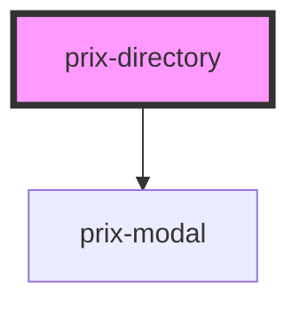

# prix-directory

<!-- Auto Generated Below -->

## Properties

| Property        | Attribute       | Description       | Type  | Default |
| --------------- | --------------- | ----------------- | ----- | ------- |
| `configuration` | `configuration` |                   | `any` | `{}`    |
| `data`          | `data`          | Common attributes | `any` | `{}`    |
| `styling`       | `styling`       |                   | `any` | `{}`    |

## Dependencies

### Depends on

- [prix-modal](../Modal)

### Graph

----------------------------------------------

*Built with [StencilJS](https://stenciljs.com/)*
