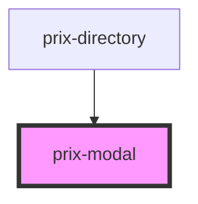

# prix-modal

<!-- Auto Generated Below -->

## Properties

| Property               | Attribute                 | Description       | Type     | Default     |
| ---------------------- | ------------------------- | ----------------- | -------- | ----------- |
| `acceptLabel`          | `accept-label`            |                   | `string` | `"Ok"`      |
| `acceptLabelColor`     | `accept-label-color`      |                   | `string` | `"#EAF4EB"` |
| `acceptLabelColorText` | `accept-label-color-text` |                   | `string` | `"#43a047"` |
| `cancelLabel`          | `cancel-label`            |                   | `string` | `"Cancel"`  |
| `cancelLabelColor`     | `cancel-label-color`      |                   | `string` | `"#fbe4e4"` |
| `cancelLabelColorText` | `cancel-label-color-text` |                   | `string` | `"#b52626"` |
| `colorBody`            | `color-body`              |                   | `string` | `"white"`   |
| `colorBodyText`        | `color-body-text`         |                   | `string` | `"black"`   |
| `colorFooter`          | `color-footer`            |                   | `string` | `"white"`   |
| `colorHeader`          | `color-header`            | Common attributes | `string` | `"white"`   |
| `colorHeaderText`      | `color-header-text`       |                   | `string` | `"black"`   |
| `expandSizeWidth`      | `expand-size-width`       |                   | `string` | `"80%"`     |

## Events

| Event           | Description     | Type               |
| --------------- | --------------- | ------------------ |
| `triggerCancel` |                 | `CustomEvent<any>` |
| `triggerOk`     | Event Emmitters | `CustomEvent<any>` |

## Methods

### `hideModal() => Promise<void>`

#### Returns

Type: `Promise<void>`

### `onCancelEvent() => Promise<void>`

#### Returns

Type: `Promise<void>`

### `onOkEvent() => Promise<void>`

Public API Methods

#### Returns

Type: `Promise<void>`

### `showModal() => Promise<void>`

#### Returns

Type: `Promise<void>`

## Dependencies

### Used by

 - [prix-directory](..\Directory)

### Graph

----------------------------------------------

*Built with [StencilJS](https://stenciljs.com/)*
