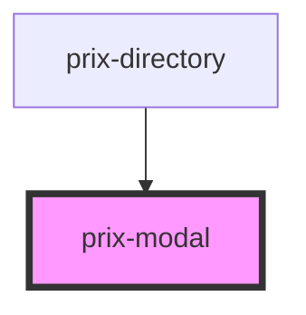

# prix-modal

<!-- Auto Generated Below -->

## Properties

| Property        | Attribute       | Description       | Type     | Default     |
| --------------- | --------------- | ----------------- | -------- | ----------- |
| `acceptLabel`   | `accept-label`  |                   | `string` | `undefined` |
| `canceLabel`    | `cance-label`   |                   | `string` | `undefined` |
| `configuration` | `configuration` |                   | `any`    | `{}`        |
| `data`          | `data`          | Common attributes | `any`    | `{}`        |
| `label`         | `label`         |                   | `string` | `undefined` |
| `styling`       | `styling`       |                   | `any`    | `{}`        |

## Dependencies

### Used by

 - [prix-directory](../Directory)

### Graph

----------------------------------------------

*Built with [StencilJS](https://stenciljs.com/)*
