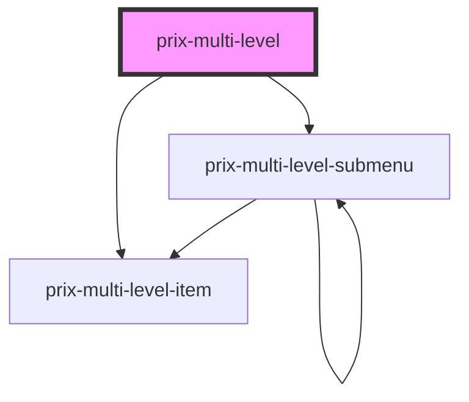

# prix-multi-level

<!-- Auto Generated Below -->

## Properties

| Property  | Attribute | Description       | Type      | Default     |
| --------- | --------- | ----------------- | --------- | ----------- |
| `color`   | `color`   |                   | `string`  | `'#0033a0'` |
| `dark`    | `dark`    |                   | `boolean` | `false`     |
| `data`    | `data`    |                   | `any`     | `{}`        |
| `message` | `message` | COMMON ATTRIBUTES | `string`  | `undefined` |

## Dependencies

### Depends on

- [prix-multi-level-item](Funtional Components)
- [prix-multi-level-submenu](Funtional Components)

### Graph

----------------------------------------------

*Built with [StencilJS](https://stenciljs.com/)*
